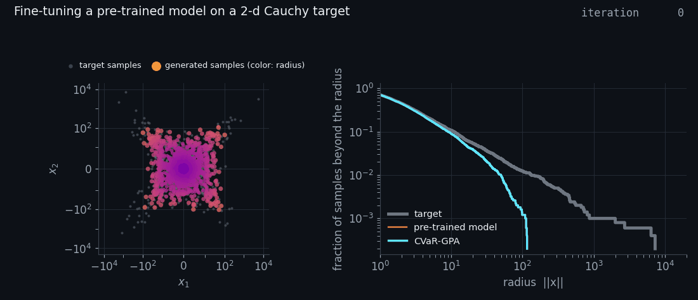
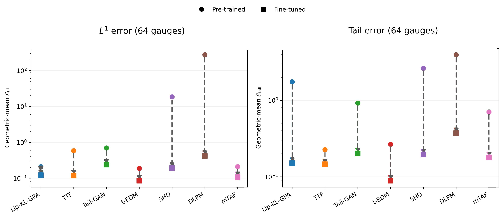

# CVaR-GPA

Code for the paper "Fine-Tuning Generative Models for Extreme Events via CVaR-Penalized Wasserstein Gradient Flows" ([arXiv:2608.11544](https://arxiv.org/abs/2608.11544)) by Thejani Gamage, Hyemin Gu, Zhizhen Zhang, Ziyu Chen, Markos A. Katsoulakis and Luc Rey-Bellet.



*Fine-tuning a pre-trained model (Lip-KL-GPA) on a 2-d Cauchy target with 5000 particles. Left: the particles, colored by their radius. Right: the complementary CDF (CCDF) of the radius `||x||`. The largest radius is 116 in the pre-trained sample, 7263 in the target sample and 7354 after fine-tuning.*

CVaR-GPA is a particle algorithm that fine-tunes the samples of a pre-trained generative model towards a heavy-tailed target. Each particle follows the gradient of a Lipschitz-regularized KL critic plus a term that closes the gap in the Conditional Value-at-Risk (CVaR) of the radius `||x||`.

## Installation

```bash
git clone https://github.com/zhizhen-z/CVaR-GPA.git
cd CVaR-GPA
pip install -r requirements.txt        # Python 3.10
```

This covers the two drivers, `analysis/` and `examples/`. The six external pre-trained models need a second environment, described in [docs/reproduce.md](docs/reproduce.md).

## Quick start

```bash
python examples/quickstart.py
```

The script pre-trains a model on the 2-d Cauchy target with Lip-KL-GPA (4000 iterations), fine-tunes it with CVaR-GPA (2000 iterations, with the settings of the paper), prints both error metrics and writes an animation like the one above to `assets/quickstart/`. It runs on a CPU and took 6.5 minutes on 4 threads. Its output on our machine:

```
2-d Cauchy target, 5000 samples, 2000 fine-tuning iterations
                         pre-trained    fine-tuned
global L1 error               7.1225        2.8012
tail error                    4.3074        0.2352
largest radius                   109          5688     (target: 7263)
```

`python examples/quickstart.py --iterations 20000` runs the fine-tuning as long as in the paper. The numbers change with the CPU model.

`examples/animation.py` makes the same animation from any fine-tuning run on a 2-d target:

```bash
python examples/animation.py <fine-tuned run .pickle> <pre-trained model .pickle> <output .gif>
```

## Use it on your own samples

CVaR-GPA needs two files: the samples of your model and the samples of the target.

```python
import pickle
import numpy as np

np.save("my_target.npy", target)                     # shape (N, d)
with open("my_model.pickle", "wb") as fh:            # samples of your model, shape (M, d)
    pickle.dump([{}, {"trajectories": [samples.astype(np.float32)]}], fh)
```

```bash
cd cvar_gpa
python cvar_gpa_smooth.py --dataset CVaR_custom \
    --target_file /path/to/my_target.npy --init_P_file /path/to/my_model.pickle \
    --N_samples_P <M> --beta_level <alpha> \
    --f KL --formulation DV -L 0.125 --lr_P 25 --epochs 20000 --save_iter 200 \
    --lam 4e-3 --lam_rule fixed --activation_ftn leaky_relu_001 --cvar_gate ramp --ramp_h 0.5 \
    --stop_tail_ke_median 1e-10 --stop_ke_median 1e-10 --stop_median_window 1000 \
    --random_seed 0 --exp_no my_run
```

The paper uses `M = N` and `alpha = 1 - 3/N`. The fine-tuned samples are `result["trajectories"][-1]` in the output file `assets/CVaR_custom/KL-Lipschitz_0.1250_ramp_<N>_<M>_00_my_run.pickle`. [docs/usage.md](docs/usage.md) explains the arguments, the file formats and how to pre-train a model on your target.

## Results on seven pre-trained models



*Daily streamflow at 64 gauges: global L1 error and tail error of seven pre-trained models before (circles) and after (squares) fine-tuning with CVaR-GPA, as geometric means over the 64 marginals. The same hyperparameters are used for all seven models.*

## Reproducing the paper

The repository holds the launchers of every experiment of the paper, the wrappers of the seven pre-trained models, the two real datasets, and the metrics, tables and figures of our runs (`analysis/`). [docs/reproduce.md](docs/reproduce.md) describes them.

## Contact

For any questions regarding the implementation, please contact zhizhenzhang@umass.edu.

## Citation

```bibtex
@misc{gamage2026finetuninggenerativemodelsextreme,
      title={Fine-Tuning Generative Models for Extreme Events via CVaR-Penalized Wasserstein Gradient Flows},
      author={Thejani Gamage and Hyemin Gu and Zhizhen Zhang and Ziyu Chen and Markos Katsoulakis and Luc Rey-Bellet},
      year={2026},
      eprint={2608.11544},
      archivePrefix={arXiv},
      primaryClass={stat.ML},
      url={https://arxiv.org/abs/2608.11544},
}
```

## License

The code in this repository is released under the MIT License (see `LICENSE`). The third-party repositories keep their own licenses, and the data files in `cvar_gpa/data/` remain subject to the terms of their sources.
